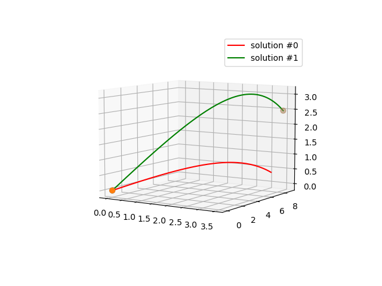

# Projectile Solver

## Quick start:

compile using `make` run using

`./projectile_solver turret_x turret_y turret_z target_x target_y target_z turret_vel_x turret_vel_y power`

`python plot.py resultsinitial.dat resultsfinal.dat`

## How it works

This program attempts to find a turret angle, given an initial position and velocity of the turret, a target position and a projectile velocity, such that the projectile hits the target.

Drag is assumed to be quadratic with respect to projectile velocity, therefor no analytical solution exists. 

The solution is found in two steps:

First an analytical solution for the plane angle is computed to find the correct x/y direction, then an adaptive numerical solver (RK45) is used to find the closest point on the trajectory to the target.

The minimum distance is then used to update the elevation angle estimation using the "secant method" and the process repeats.

In the default configuration the program generates two sets of trajectories: One from the initial elevation angle guess and one from the (hopefully) converged result.

## Example result

The orange dot marks the turret position, the gray dot marks the target. 

The red trajectory is the initial guess, the gree trajectory is the converged result.
